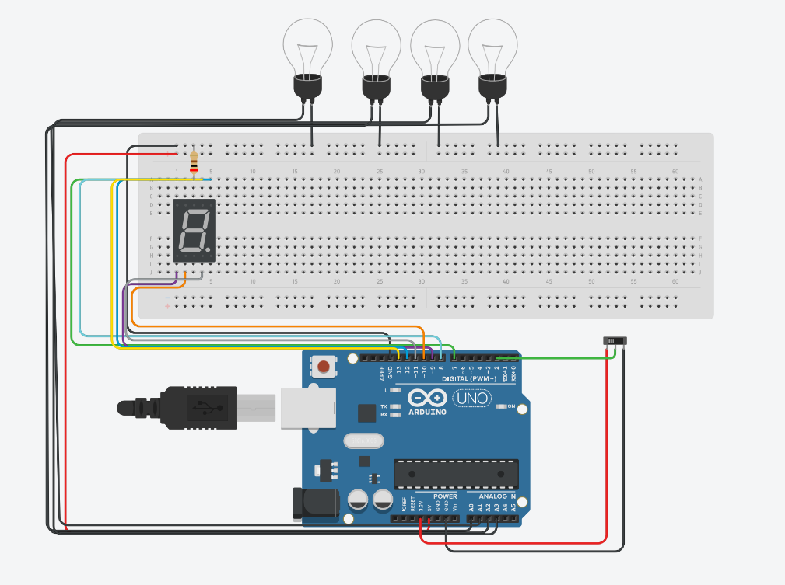

# Projeto Código Gray com Arduino

## Descrição

Este projeto foi inspirado na leitura do livro **"Programação de sistemas embarcados"**, onde explorei o conceito do **Código Gray**. O Código Gray é interessante porque permite ordenar valores alterando apenas um dígito de cada vez, o que torna as transições mais suaves em sistemas digitais. 

Decidi implementar uma representação simplificada desse conceito utilizando **Arduino**, exibindo as representações binária e Gray em lâmpadas e mostrando o valor decimal correspondente em um display de sete segmentos.

## Como Funciona

- **Interruptor de Controle**: O projeto é controlado por um interruptor deslizante conectado ao pino digital 2 do Arduino. 
  - Quando o interruptor é acionado, o programa alterna entre dois modos:
    - **Modo Binário**: As lâmpadas representam os números em formato binário (de 1 a 8).
    - **Modo Gray**: As lâmpadas representam os números no formato Código Gray (de 1 a 8).
  - O display de sete segmentos exibe o valor decimal correspondente ao número mostrado pelas lâmpadas.

- **Lâmpadas**: São utilizadas 4 lâmpadas (ou LEDs) para representar o número binário ou Gray em 4 bits. 
  - As lâmpadas acendem ou apagam conforme o valor de cada bit, de acordo com o modo selecionado.

- **Display de Sete Segmentos**: O valor decimal é mostrado no display de sete segmentos, que é atualizado em tempo real com a mudança das lâmpadas.

## Link do Projeto no Tinkercad

O projeto foi desenvolvido no [Tinkercad](https://www.tinkercad.com/things/fq628nrYBXC-codigo-gray). Você pode acessar o protótipo e visualizar o circuito, além de realizar simulações.

## Imagens do Projeto

### Protótipo no Tinkercad

Aqui está uma imagem do protótipo montado no Tinkercad:

### Esquema do Circuito

O esquema do circuito utilizado para o projeto pode ser visualizado abaixo:

## Como Executar

1. **Hardware**:
   - Um **Arduino UNO**.
   - 4 **LEDs** para representar os valores binários e Gray.
   - 1 **display de sete segmentos** para exibir os valores decimais.
   - 1 **interruptor deslizante** para alternar entre os modos.

2. **Código**:
   - O código foi desenvolvido utilizando **C++** para Arduino, utilizando apenas funções básicas da plataforma, sem bibliotecas externas.
   - O código alterna entre os modos binário e Gray, atualizando tanto as lâmpadas quanto o display de sete segmentos.

3. **Passos**:
   - Carregue o código no seu Arduino utilizando o **IDE do Arduino**.
   - Conecte os LEDs e o display de sete segmentos conforme o circuito no Tinkercad.
   - Aponte o interruptor para alternar entre os modos e observe as lâmpadas e o display funcionando.

## Tecnologias Utilizadas

- **Arduino IDE** para programação do Arduino.
- **C++** para codificação do projeto.
- **Tinkercad** para modelagem e simulação do circuito.

## Créditos

Este projeto foi desenvolvido com o auxílio da IA generativa **ChatGPT**, que ajudou na elaboração do código e na criação do fluxo de funcionamento do projeto.

## Licença

Este projeto está disponível sob a licença **MIT**. Você pode usá-lo, modificar e distribuí-lo conforme necessário, mas sem responsabilidade sobre possíveis danos.

---

Obrigado por conferir o projeto!
